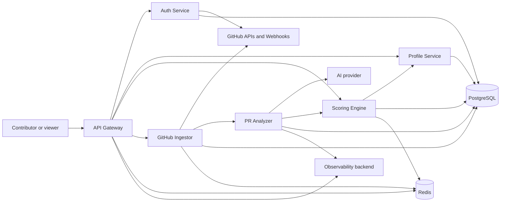
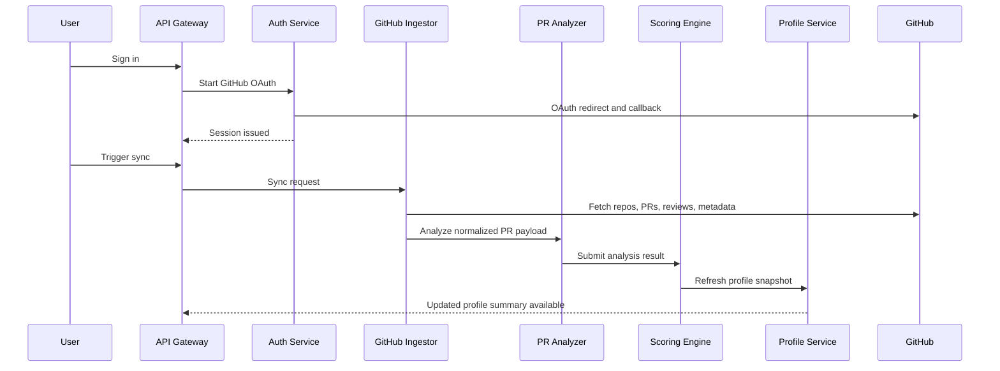
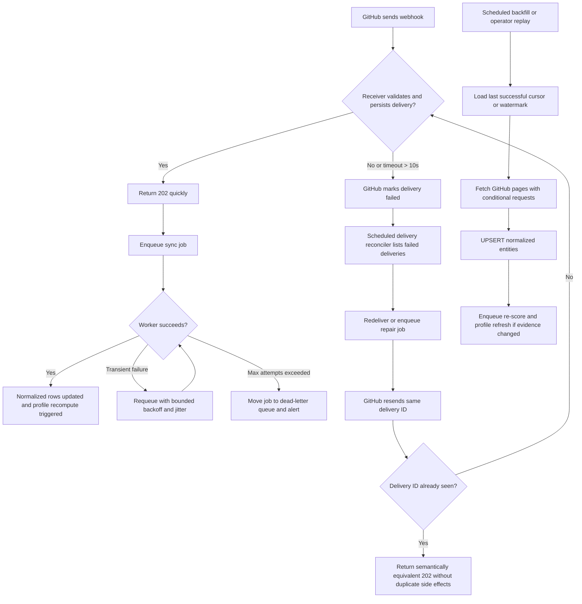

# Architecture

## Purpose

GitRank turns GitHub contribution history into an evidence-backed reputation profile. The architecture is designed around three constraints:

1. GitHub data is noisy and rate-limited.
2. Scoring must be explainable and replayable.
3. AI should enrich analysis, not replace deterministic controls.

## System Context

## Service Responsibilities

### API Gateway

- primary HTTP edge
- auth enforcement
- request validation
- response shaping
- rate limiting

### Auth Service

- GitHub OAuth
- user identity lifecycle
- session or JWT issuance
- account linking

### GitHub Ingestor

- webhook processing
- REST and GraphQL fetches
- rate-limit-aware sync logic
- normalization and persistence

### PR Analyzer

- deterministic PR feature extraction
- AI-assisted categorization
- classification output validation
- derived language, issue-link, review-cycle, and critical-path signals for downstream scoring

### Scoring Engine

- deterministic score calculation
- score versioning
- badge, level, and skill aggregation

### Profile Service

- read models for public and private profiles
- cached profile summaries
- contribution timelines

### Scheduler Worker

- periodic syncs
- backfills
- re-score jobs
- repair and replay jobs

## Communication Model

The preferred architecture is hybrid:

- synchronous HTTP for user-facing reads and explicit commands
- asynchronous events and jobs for ingestion, analysis, and re-scoring

This avoids long request chains on critical user paths and keeps retry-heavy work out of request-response flows.

## Event Flow

Core domain events:

- `github.sync.requested`
- `github.pull_request.ingested`
- `analysis.contribution.completed`
- `scoring.contribution.completed`
- `profile.snapshot.refreshed`

Every event should have:

- a stable event ID
- timestamp
- schema version
- actor or source
- correlation ID

## Request and Job IDs

Every HTTP request and async job should carry:

- `request_id`
- `correlation_id`
- `service_name`
- `job_id` when async
- W3C `traceparent`

HTTP handlers continue incoming `traceparent` values or create a new trace when absent.
Outbound internal calls, scheduler-triggered async execution, GitHub API calls, OAuth token calls, and AI request builders inject child `traceparent` headers so traces can be stitched by an OpenTelemetry collector or compatible proxy later.

## Idempotency Strategy

GitRank should assume at-least-once delivery for webhooks, queue jobs, and retried upstream API calls.

The architecture baseline is:

- every externally triggered mutating operation must have an idempotency key
- every idempotency key must be recorded in durable storage before or atomically with its side effects
- duplicate requests should return a semantically equivalent success response when the original operation already succeeded
- duplicate requests must not create duplicate score events, duplicate profile refreshes, or duplicate GitHub entity rows

Canonical idempotency keys:

- GitHub webhooks: `github_delivery_id`
- manual sync commands: caller-supplied `Idempotency-Key` header or a server-generated command key
- internal jobs: deterministic `dedupe_key = job_type + scope + version + subject`
- GitHub entities: natural keys plus UPSERTs such as repository ID, pull request ID, review ID, issue ID, label ID, and commit SHA
- score events: `score_version + contribution_subject + evidence_hash`
- profile snapshots: `user_id + snapshot_version + source_watermark`

Persistence rules:

- the webhook receiver should store the delivery record and enqueue work in the same transactional unit when backed by PostgreSQL
- queue workers should write idempotency records and business mutations atomically
- replaying the same delivery or job should be safe and should converge on the same final state

## Retry Semantics

Retries are allowed only when the caller can prove the retried operation is safe.

Baseline retry policy:

- GitHub webhooks: no inline business retry in the request handler; acknowledge quickly after validation, persistence, and enqueue
- internal queue jobs: bounded retries with exponential backoff and jitter, then dead-letter after `JOB_MAX_ATTEMPTS`
- GitHub REST and GraphQL reads: retry transient transport failures, `403` secondary-rate-limit responses, `429`, and `5xx`
- GitHub REST and GraphQL reads: open a circuit breaker after repeated provider-side failures, then fail fast until the configured cool-down interval allows a half-open probe
- GitHub mutating requests: retry only when protected by an idempotent request contract
- AI calls: retry only on transport failures, `429`, and `5xx`; do not retry schema-validation failures or deterministic prompt contract failures
- synchronous user-facing reads: avoid automatic fan-out retries in the gateway; fail fast and surface partial degradation instead of amplifying load

Outbound request safety:

- sync targets are normalized as GitHub logins, `owner/repo` identifiers, numeric issue/PR/review IDs, and hexadecimal commit IDs before they can shape GitHub API paths
- configured outbound HTTP clients reject non-HTTP(S) schemes, userinfo, query strings, and fragments in base URLs
- api-gateway proxy paths must remain absolute paths relative to the configured service base URL and cannot be path-relative URLs such as `//host/path`

Retry classes:

- at-most-once: non-idempotent external mutations without a stable request token
- at-least-once with idempotent effects: webhook processing, sync jobs, backfills, re-scoring, and profile refresh jobs
- no retry: validation failures, authorization failures, malformed payloads, and policy exclusions

## Timeout Budgets

The architecture uses explicit time budgets so callers do not wait forever and servers stop work that the caller no longer wants.

Default v1 budgets:

| Path | Target | Hard cap | Notes |
| --- | --- | --- | --- |
| GitHub webhook receiver ack | 2s | 10s | Must stay comfortably under GitHub's delivery timeout |
| API Gateway to internal read APIs | 800ms | 1.5s | Profile and dashboard reads should degrade fast |
| API Gateway to internal command APIs | 1.5s | 3s | Includes explicit sync triggers |
| Service-to-service HTTP default | 2s | 5s | Matches `INTERNAL_API_REQUEST_TIMEOUT` ceiling |
| Auth to GitHub token endpoints | 2s | 5s | User login should not hang on slow token exchange |
| Ingestor to GitHub REST or GraphQL | 3s | 10s | Use queue workers for retries, not long blocking chains |
| Analyzer to AI provider | 8s | 20s | Never on the critical read path |
| Worker job lease | 30s target work unit | 2m lease | Renew or split long jobs instead of blocking one lease forever |

Budgeting rules:

- always set explicit timeouts on outbound calls
- propagate the remaining caller budget downstream when the request is synchronous
- asynchronous work should convert request deadlines into job-level soft timeouts and lease expiration
- if a downstream dependency exceeds its budget, cancel work and rely on replayable jobs instead of stretching the timeout

## Source of Truth and Read Models

GitRank uses a layered source-of-truth model.

Authoritative facts:

- normalized GitHub entities in PostgreSQL are the source of truth for raw repository, pull request, review, issue, label, commit, and delivery data
- contribution analyses are the source of truth for classifier outputs and evidence extraction
- score events are the source of truth for versioned contribution scoring decisions

Authoritative read state:

- the latest successful `profile_snapshot` is the canonical read model for serving a user's current profile aggregate

Rebuild model:

- `profile_snapshots` are disposable and rebuildable
- if a snapshot is missing or stale, the system should rebuild it from durable score events, badge state, and normalized evidence
- readers should use snapshots for latency; operators should trust the durable event history for replay and audit

## Recompute and Replay Model

Recomputation jobs are triggered by:

- a newly ingested or updated eligible pull request
- a newly completed contribution analysis
- a newly completed score event
- a scoring formula version change
- an AI analyzer version or prompt contract change
- a manual operator repair request
- a scheduled reconciliation or backfill window

Replay entry points:

- replay a webhook delivery by `github_delivery_id`
- replay a sync scope by installation, repository, user, PR number, or commit SHA
- replay a score scope by user, repository, contribution, or date range
- replay a profile snapshot rebuild by user ID and target version

Replay invariants:

- replays must be idempotent
- replays must preserve prior versions for audit
- replays should be resumable after interruption
- replays should write progress watermarks so large backfills can continue from the last safe cursor

## Historical Re-scoring

Historical re-scoring is append-only.

Rules:

- never mutate a historical score event in place to represent a new formula decision
- write a new score event with a new `score_version`
- keep the prior score event for audit, explainability, and rollback analysis
- rebuild the user's latest `profile_snapshot` from the newest accepted score version
- support scoped re-scoring by user, repository, cohort, date window, or formula version
- run large re-scoring jobs in batches with canary cohorts before global rollout

Operational approach:

- the scheduler owns `score.replay_user`, `profile.refresh_user`, `report.materialize_pull_request`, and `pipeline.grade_pull_request` job orchestration
- the scoring engine remains deterministic for a given input evidence set and `score_version`
- rollback means switching the read model back to an older accepted score version and replaying snapshots from that version

## Sequence: Initial Sync

## Failure-Mode Diagram: Webhook Retries and Backfills

## Failure and Recovery

Key failure modes:

- GitHub webhook delivery retry storms
- REST or GraphQL secondary rate limits
- partial persistence during sync
- AI provider timeout or malformed output
- score formula rollout incompatibility

Countermeasures:

- idempotency keys for webhook deliveries and jobs
- bounded retries with backoff
- dead-letter queue
- schema validation on AI output
- score formula versioning
- replayable event or snapshot model

## External Reliability Baseline

This architecture baseline is informed by:

- GitHub webhook guidance to respond within 10 seconds, queue async work, use `X-GitHub-Delivery`, and redeliver missed deliveries
  Source: <https://docs.github.com/en/enterprise-cloud@latest/webhooks/using-webhooks/best-practices-for-using-webhooks>
- GitHub webhook failure guidance that failed deliveries are not automatically redelivered and should be reconciled on a schedule
  Source: <https://docs.github.com/en/webhooks/using-webhooks/handling-failed-webhook-deliveries>
- GitHub REST guidance to avoid polling, avoid concurrency spikes, pause between mutative requests, and use conditional requests
  Source: <https://docs.github.com/en/rest/using-the-rest-api/best-practices-for-using-the-rest-api>
- GitHub rate-limit guidance to honor `Retry-After`, `x-ratelimit-reset`, and exponential backoff for secondary rate limits
  Source: <https://docs.github.com/en/enterprise-cloud@latest/rest/using-the-rest-api/rate-limits-for-the-rest-api>
- GitHub GraphQL guidance to use cursor pagination and the rate-limit headers instead of extra status queries where possible
  Sources:
  <https://docs.github.com/en/graphql/guides/using-pagination-in-the-graphql-api>
  <https://docs.github.com/en/graphql/overview/rate-limits-and-query-limits-for-the-graphql-api>

GitRank's shared GitHub REST and GraphQL clients include fault-injection tests for secondary-rate-limit responses, bounded retries, final metadata capture, and `Retry-After` precedence.
- AWS guidance to use caller-provided idempotency identifiers and semantically equivalent responses for duplicate requests
  Source: <https://aws.amazon.com/builders-library/making-retries-safe-with-idempotent-apis/>
- AWS guidance to choose timeouts deliberately and use backoff with jitter
  Source: <https://aws.amazon.com/builders-library/timeouts-retries-and-backoff-with-jitter/>
- gRPC guidance to always set deadlines and propagate remaining budgets downstream
  Source: <https://grpc.io/docs/guides/deadlines/>

## Non-Goals for v1

- ranking private company code without explicit consent
- opaque ML-only scoring
- real-time leaderboard updates on every event
- fully customizable user-defined scoring formulas
