# GitRank Mermaid Flows

These diagrams describe the main GitRank product and platform flows. Each flow
includes the normal path plus the important degraded or failure paths that the
code and runbooks are designed to surface.

## 1. GitHub OAuth Login

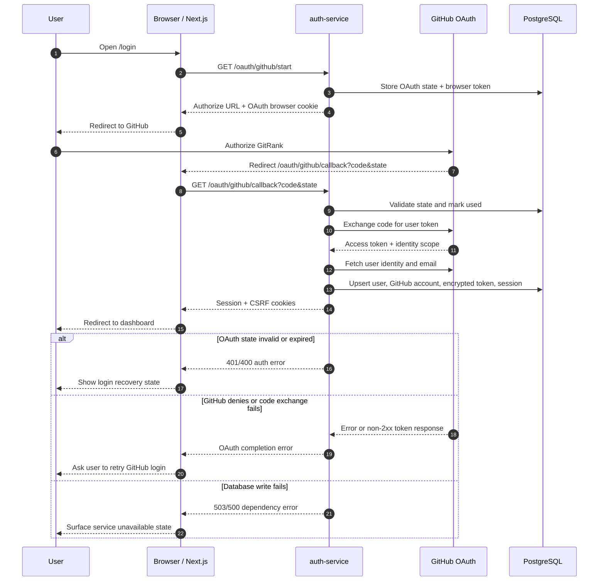

## 2. Authenticated Dashboard Load

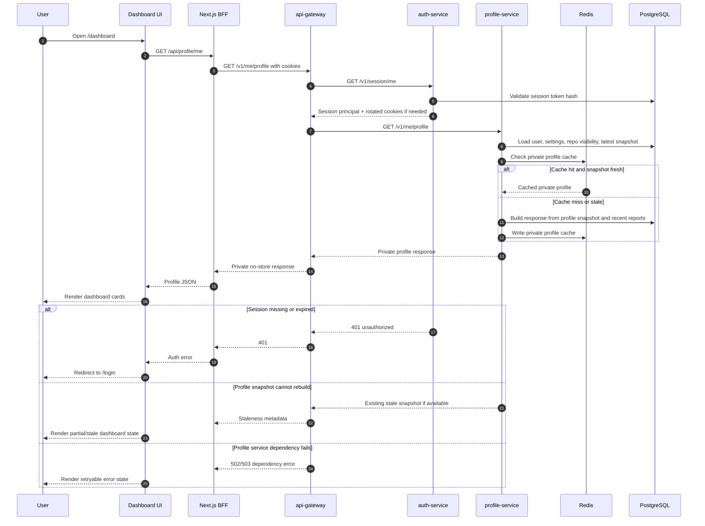

## 3. Background Auto-Sync

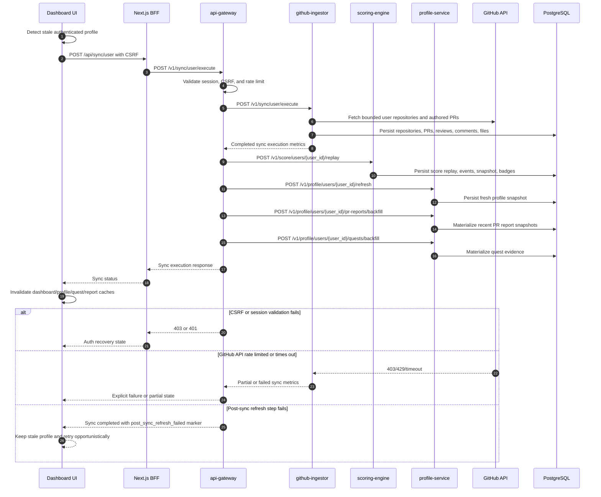

## 4. User GitHub Sync

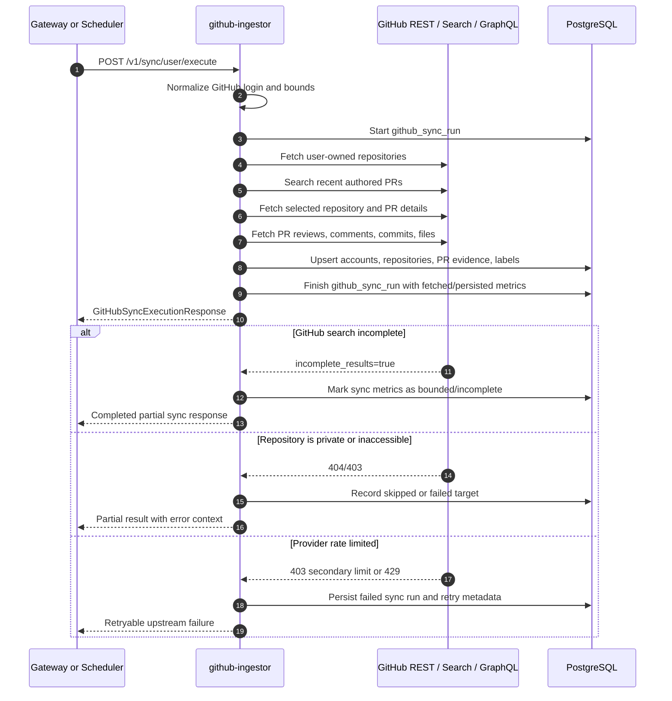

## 5. Repository Sync

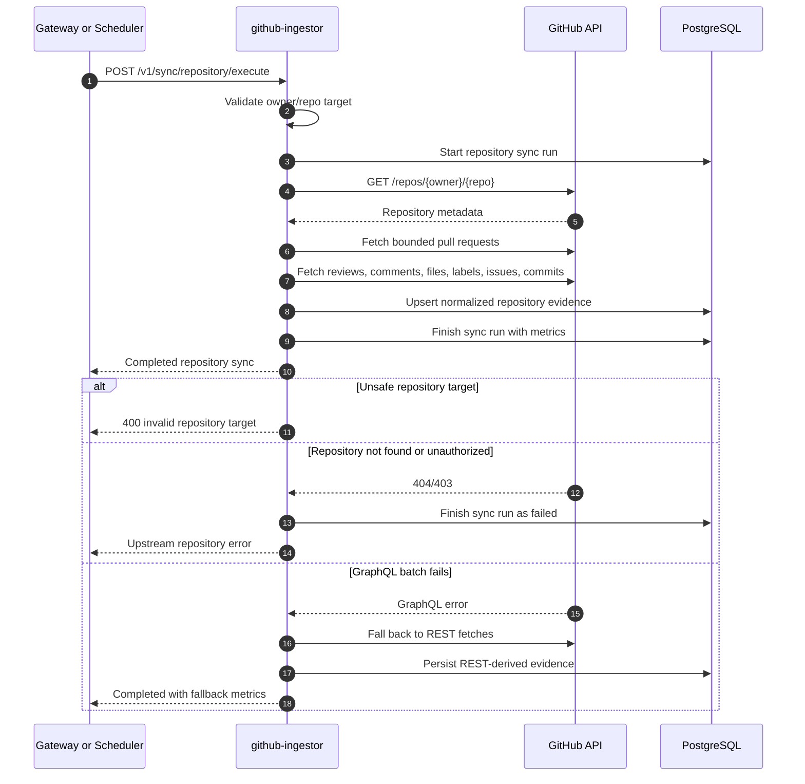

## 6. PR Analysis

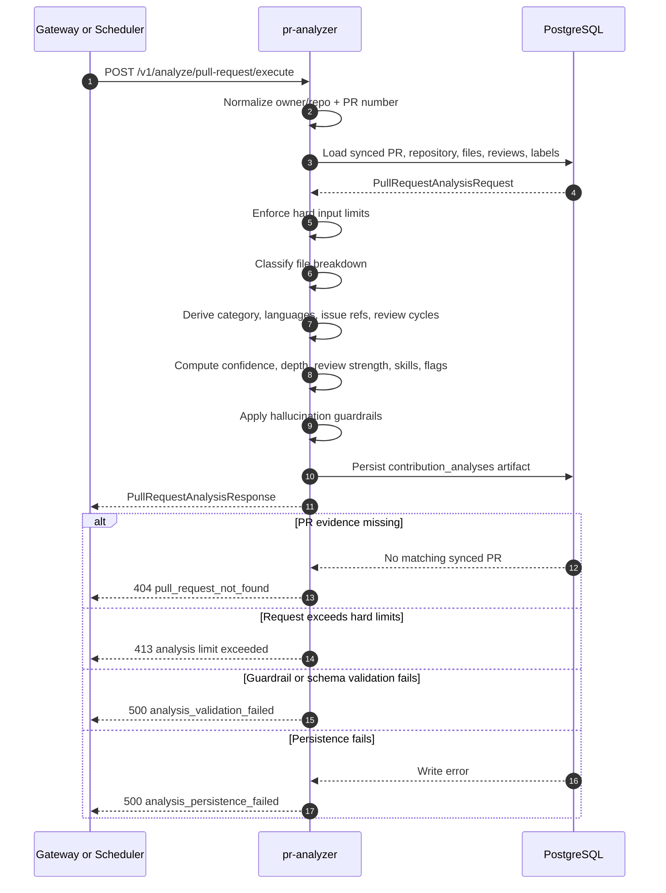

## 7. Gemini Summary Enrichment

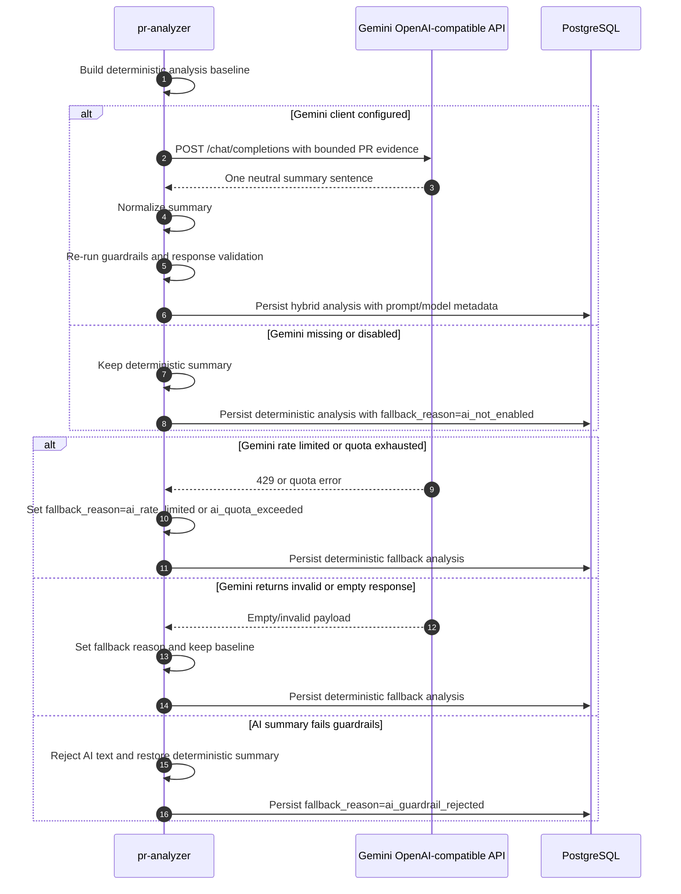

## 8. Score Replay

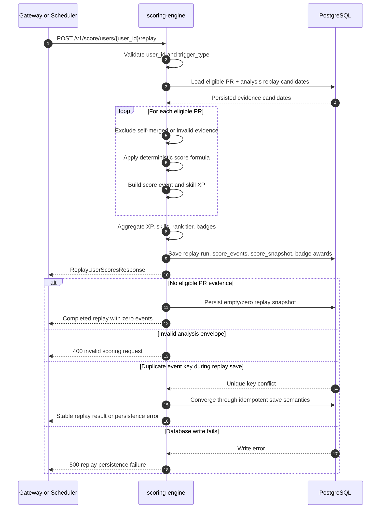

## 9. Profile Snapshot Refresh

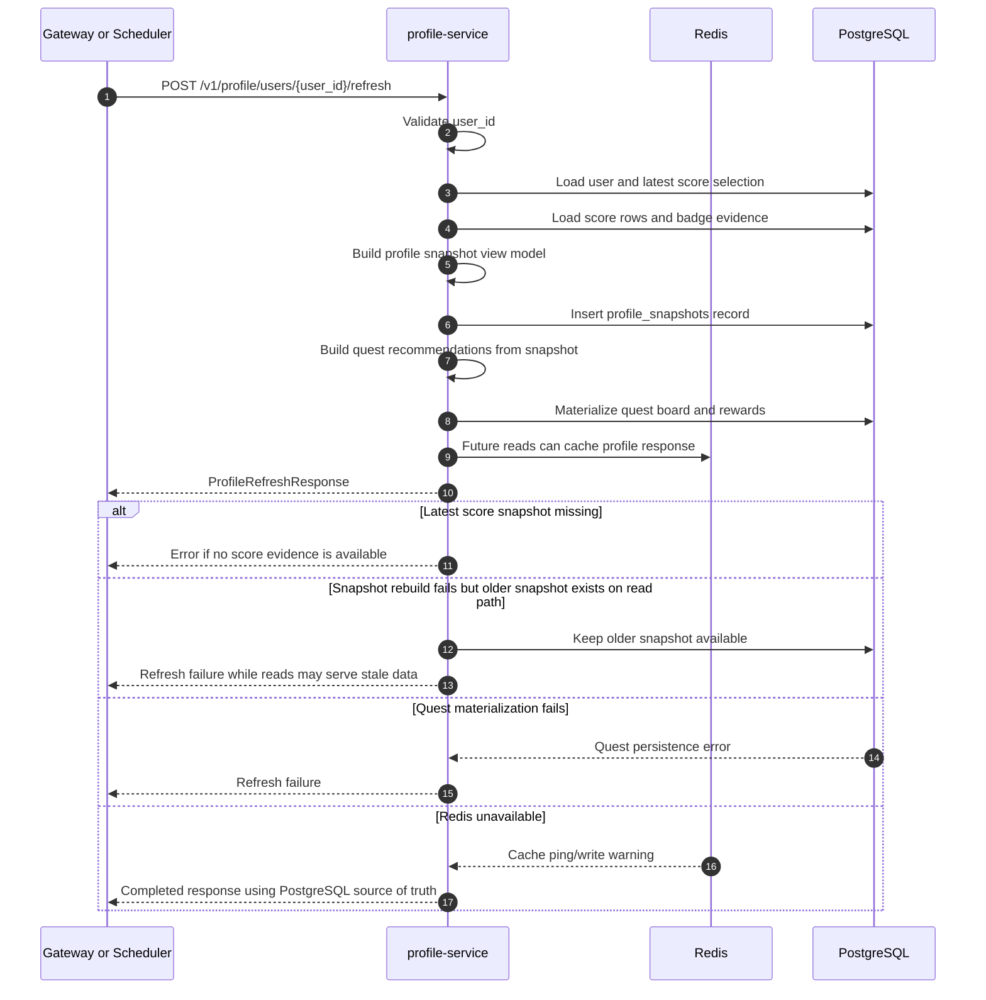

## 10. Public Profile View

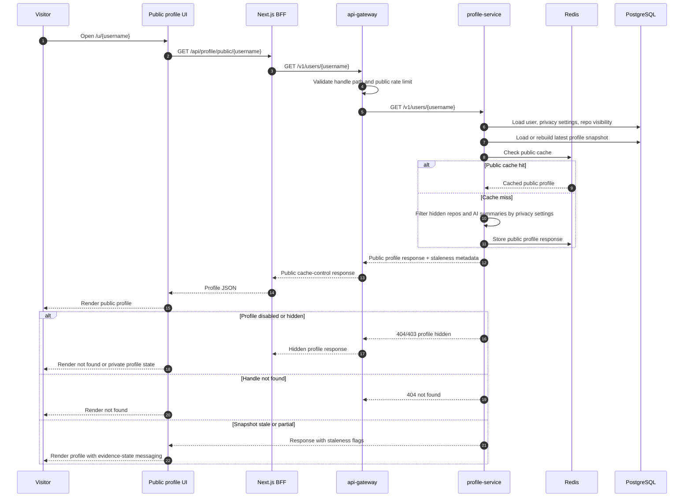

## 11. PR Battle Report

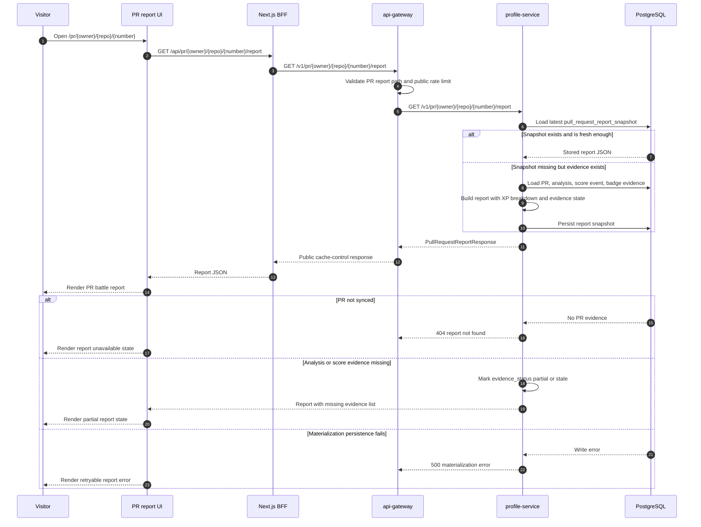

## 12. Scheduler And Backfill Job Lifecycle

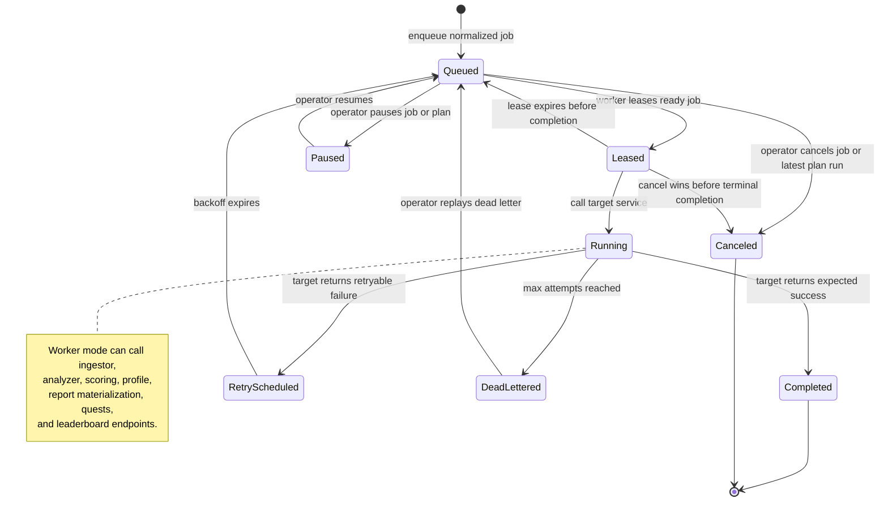

## End-To-End Product Flow

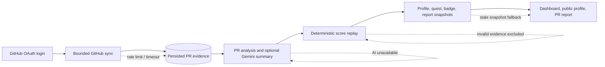
